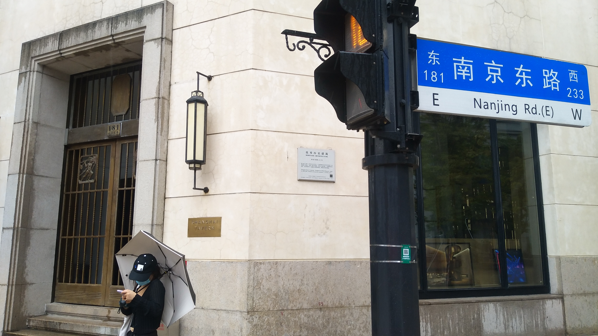
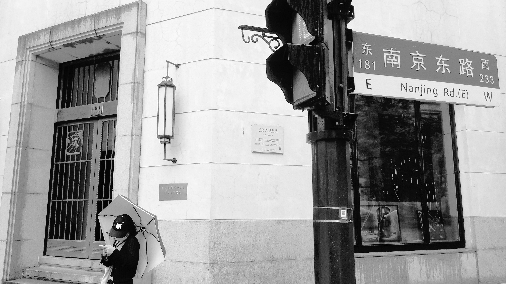
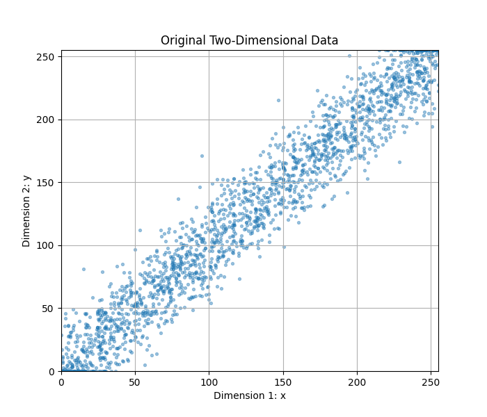
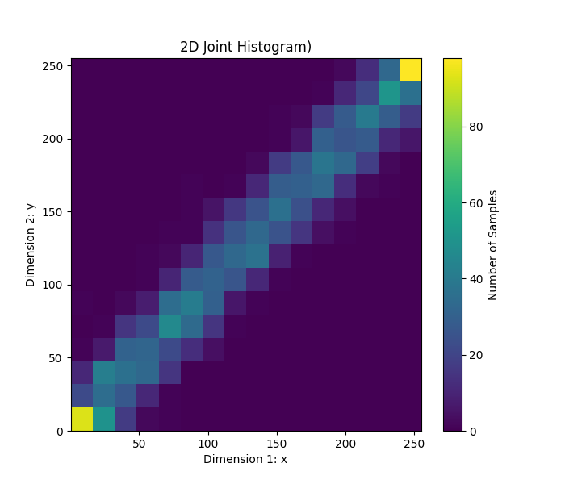
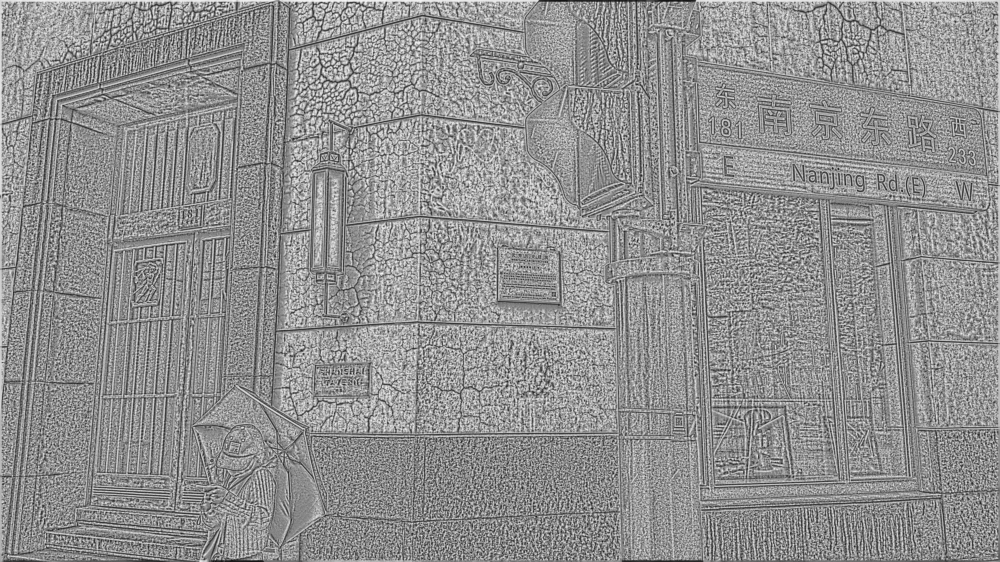

# 数字图像处理 · 第一次作业报告

---

## 0. 概述

### 0.1 开发环境

| 项目 | 版本 / 说明 |
| --- | --- |
| 操作系统 | Windows |
| Python | 3.12（Anaconda） |
| OpenCV (`cv2`) | 5.0.0 |
| NumPy | 2.0.2 |
| Matplotlib | 3.10.8 |

### 0.2 文件与数据清单

| 文件 | 作用 |
| --- | --- |
| `p1.py` | 任务一：分段线性变换（对比度拉伸） |
| `p2_1.py` | 任务二(1)：n 维联合直方图 + 二维数据测试绘图 |
| `p2_2.py` | 任务二(2)：局部直方图的增量（高效）更新 |
| `p3_1.py` | 任务三(1)：直方图均衡化 |
| `p3_2.py` | 任务三(2)：局部直方图均衡化 |
| `img/resource.jpg` | 输入测试图像 |
| `img/output_1.jpg` | 任务一输出：对比度拉伸结果 |
| `img/output_3.jpg` | 任务三输出：局部直方图均衡化结果 |
| `img/Figure_1.png` | 任务二(1) 图 1：二维数据散点图 |
| `img/Figure_2.png` | 任务二(1) 图 2：二维联合直方图 |

### 0.3 数据说明

- **图像数据**：`img/resource.jpg`，以 `cv2.IMREAD_GRAYSCALE` 读入为单通道 `uint8` 图像，像素灰度取值 $[0, 255]$，共 $L = 256$ 个灰度级。任务一与任务三均直接在该图上处理、并保存为新图像。
- **合成二维数据**（任务二(1) 测试用）：$N = 2000$ 个样本，
  $$x \sim U(0, 255), \qquad y = \mathrm{clip}\bigl(x + \varepsilon,\ 0,\ 255\bigr), \qquad \varepsilon \sim \mathcal{N}(0, 20^2)$$


---

## 1. 任务一：分段线性变换（对比度拉伸）

### 1.1 原理

本作业使用的折线由 4 个控制点确定：
$$(0,\,0) \;\rightarrow\; (r_1,\,s_1) \;\rightarrow\; (r_2,\,s_2) \;\rightarrow\; (L-1,\,L-1)$$

由于题目没说，我自己选定了参数 $L = 256,\ r_1 = 32,\ s_1 = 16,\ r_2 = 64,\ s_2 = 128$，得到分段公式：

$$
s = T(r) =
\begin{cases}
\dfrac{s_1}{r_1}\,r, & 0 \le r < r_1 \quad(\text{暗区，斜率 } 0.5)\\[2mm]
s_1 + \dfrac{s_2 - s_1}{r_2 - r_1}\,(r - r_1), & r_1 \le r < r_2 \quad(\text{中间灰度，斜率 } 3.5)\\[2mm]
s_2 + \dfrac{(L-1) - s_2}{(L-1) - r_2}\,(r - r_2), & r_2 \le r \le L-1 \quad(\text{亮区，斜率 } \approx 0.665)
\end{cases}
$$


### 1.2 代码实现（`p1.py`）

```python
import cv2

# ---------------------------------------------------------------------------
# 任务 1：分段线性变换（对比度拉伸）
# ---------------------------------------------------------------------------
def pixel_process(in_, L=256, r1=32, s1=16, r2=64, s2=128):
    """把单像素灰度 in_ 按折线 (0,0)-(r1,s1)-(r2,s2)-(L-1,L-1) 映射为新灰度。
    """
    in_ = int(in_)
    out_ = 0
    if 0 <= in_ < r1:                                   # 第 1 段：暗区，斜率 s1/r1 = 0.5
        out_ = in_ * s1 / r1
    elif r1 <= in_ < r2:                                # 第 2 段：中间灰度，斜率 (s2-s1)/(r2-r1) = 3.5（拉伸最强）
        out_ = s1 + (in_ - r1) * ((s2 - s1) / (r2 - r1))
    elif r2 <= in_ <= L - 1:                            # 第 3 段：亮区，斜率 (L-1-s2)/(L-1-r2) ≈ 0.665
        out_ = s2 + (in_ - r2) * ((L - 1 - s2) / (L - 1 - r2))
    return int(out_)                                    # int() 截断取整，输出仍落在 0~255


def read_intensity(in_path):
    """读入图像并转为单通道灰度图（uint8，取值 0~255）。"""
    img_gray = cv2.imread(in_path, cv2.IMREAD_GRAYSCALE)
    return img_gray


def img_process(img_gray):
    """逐像素调用 pixel_process，完成整幅图像的灰度映射。"""
    h, w = img_gray.shape
    for i in range(h):
        for j in range(w):
            img_gray[i, j] = pixel_process(img_gray[i, j])
    return img_gray


def write_image(out_path, img_processed):
    """保存结果图像。"""
    cv2.imwrite(out_path, img_processed)


def main():
    in_path = 'img/resource.jpg'
    out_path = 'img/output_1.jpg'
    img_gray = read_intensity(in_path)
    img_processed = img_process(img_gray)           # 对比度拉伸
    write_image(out_path, img_processed)


if __name__ == '__main__':
    main()
```

**流程**：`read_intensity` 读入灰度图 → `img_process` 双重循环逐像素调用 `pixel_process` 完成灰度映射 → `write_image` 保存结果。

### 1.4 实验结果

| 原图 | 分段线性变换结果 |
| --- | --- |
|  |  |


---

## 2. 任务二：联合直方图与局部直方图的高效更新

### 2.1 任务二(1)：n 维联合直方图

#### （a）算法思路

设数据为 $n$ 维、每一维的 bin 数为 $B = [B_0, B_1, \dots, B_{n-1}]$：

1. 对每一维 $i$，统计该维的最小值 $\min_i$ 与最大值 $\max_i$，得到等宽 bin 的宽度
   $$w_i = \frac{\max_i - \min_i}{B_i}$$
2. 对每个样本 $x = (x_0, \dots, x_{n-1})$，计算它落在每一维上的 bin 编号
   $$k_i = \mathrm{clamp}\!\left(\left\lfloor \frac{x_i - \min_i}{w_i} \right\rfloor,\ 0,\ B_i - 1\right)$$
   `clamp` 用于处理恰好等于最大值的样本，避免下标越界。
3. 把 $n$ 维 bin 坐标按**行主序**（第 0 维变化最快）压成一维下标
   $$\text{index} = k_0 + k_1 B_0 + k_2 B_0 B_1 + \cdots + k_i \prod_{j<i} B_j$$
   代码中用前缀乘积数组 `Pi_B` 保存 $\prod_{j \le i} B_j$，第 $i$ 维的权重即为 `Pi_B[i-1]`。
4. 对 `H[index]` 计数加一。

由于第 0 维对应最低位，把一维数组 `reshape(B[1], B[0])` 后得到的就是“行 = 第 1 维、列 = 第 0 维”的二维直方图.

#### （b）代码实现（`p2_1.py`）

```python
import math
import numpy as np
import matplotlib.pyplot as plt

# 任务 2(1)：n 维联合直方图

def n_dim_histogram(data, B):
    """
    data: N x n 的样本列表；B: 每一维的 bin 数。
    """
    # Pi_B[i] = B[0]*...*B[i]，即前 i+1 维的 bin 总数；Pi_B[i-1] 是第 i 维的跨度
    Pi_B = [B[0]] * len(B)
    for i in range(1, len(B)):
        Pi_B[i] = B[i] * Pi_B[i - 1]

    l = len(data[0])                    # 数据维数 n
    min_x = [255] * l                   # 每一维的取值下界
    max_x = [0] * l                     # 每一维的取值上界
    for x in data:
        for i in range(l):
            if x[i] > max_x[i]:
                max_x[i] = x[i]
            if x[i] < min_x[i]:
                min_x[i] = x[i]
    width = [0] * l                     # 每一维单个 bin 的宽度
    H = [0] * Pi_B[-1]                  # 展平后的直方图，共 prod(B) 个 bin
    for i in range(l):
        width[i] = (max_x[i] - min_x[i]) / B[i]

    for x in data:
        index = 0                       # 把 n 维 bin 坐标压成一维下标
        for i in range(l):
            # 第 i 维的 bin 号，截断到 [0, B[i]-1]，防止落在区间外的样本越界
            k = min(
                max(
                    math.floor((x[i] - min_x[i]) / width[i]),
                    0
                ),
                B[i] - 1
            )
            if i == 0:
                index += k
            else:
                index += k * Pi_B[i - 1]        # 第 0 维作为最低位
        H[index] += 1                           # 该 n 维 bin 计数 +1
    return H


# 测试：构造二维数据 (x, y)，两维高度相关，联合直方图应呈对角线“脊”

np.random.seed(0)
N = 2000
x = np.random.uniform(0, 255, N)            # 第 1 维：0~255 均匀分布
noise = np.random.normal(0, 20, N)
y = x + noise                               # 第 2 维：x 叠加高斯噪声
y = np.clip(y, 0, 255)
data = np.column_stack((x, y)).tolist()     # 整理成 N x 2 的样本列表
B = [16, 16]                                # 每一维 16 个 bin
H = n_dim_histogram(data, B)

# 图 2-1：原始二维数据散点图
plt.figure(figsize=(7, 6))
plt.scatter(x, y, s=8, alpha=0.4)
plt.xlabel("Dimension 1: x")
plt.ylabel("Dimension 2: y")
plt.title("Original Two-Dimensional Data")
plt.xlim(0, 255)
plt.ylim(0, 255)
plt.grid()
plt.show()

# 图 2-2：二维联合直方图（第 0 维为列、第 1 维为行，与展平顺序一致）
H_2d = np.array(H).reshape(B[1], B[0])
plt.figure(figsize=(7, 6))
plt.imshow(
    H_2d,
    origin="lower",
    aspect="auto",
    extent=[
        min(x),
        max(x),
        min(y),
        max(y)
    ]
)
plt.xlabel("Dimension 1: x")
plt.ylabel("Dimension 2: y")
plt.title("2D Joint Histogram)")
plt.colorbar(label="Number of Samples")
plt.show()
```

#### （c）二维数据测试结果

| 图 2-1 原始二维数据（散点图） | 图 2-2 二维联合直方图（16 × 16 bins） |
| --- | --- |
|  |  |


---

### 2.2 任务二(2)：局部直方图的高效（增量）更新

#### （a）原理

相邻两个窗口之间只相差一行或一列。因此把窗口从位置 $(i, j)$ 平移一格时，只需：把移出的那一行（列）的 $(2r-1)$ 个像素的计数减 1；把移入的那一行（列）的 $(2r-1)$ 个像素的计数加 1。

代码采用蛇形扫描，偶数行自左向右、奇数行自右向左。这样一来，每换到下一行时窗口的列位置无需重置，直接沿用上一行末端的直方图，只需再做一次“上边移出、下边移入”的垂直更新，避免了每行重新初始化的开销。

#### （b）实现

- 用生成器 `eff_local_hist(img, r)` 逐个 `yield (i, j, H_local)`。
- 只遍历窗口完全落在图像内部的中心点，即 $i \in [r-1,\ h-r]$、$j \in [r-1,\ w-r]$，因此输出图像四周留有 $r-1$ 像素宽的未处理边界（`p3_2.py` 中该边界保持原值）。


#### （c）代码实现（`p2_2.py`）

```python

# 任务 2(2)：局部直方图的高效（增量）更新

def eff_local_hist(img, r):
    """以 (i, j) 为中心、边长 2r-1 的方形邻域，逐个中心点生成局部直方图。

    生成器依次 yield (i, j, H_local)，i/j 遍历所有“窗口完整落在图内”的中心点。
    相邻邻域只差一行或一列，因此只需在旧直方图上做增减即可，避免重复统计。
    """
    h, w = img.shape
    i_start = r - 1          # 合法中心点范围：保证 2r-1 大小的窗口不越界
    i_end = h - r
    j_start = r - 1
    j_end = w - r
    i = i_start
    j = j_start
    H_local = [0] * 256
    # 统计第一个邻域的直方图（唯一的 O((2r-1)^2) 初始化）
    for x in range(i-r+1, i+r):
        for y in range(j-r+1, j+r):
            H_local[img[x][y]] += 1
    yield i, j, H_local.copy()

    # 蛇形（boustrophedon）扫描：行方向奇偶交替，
    # 这样换行时无需重新统计，只需“移出上一行、移入下一行”
    for i in range(i_start, i_end + 1):
        if i != i_start:
            # 垂直移动一格：窗口上边移出、下边移入
            out_row = i - r
            in_row = i + r - 1
            for y in range(j-r+1, j+r):
                H_local[img[out_row][y]] -= 1
                H_local[img[in_row][y]] += 1
            yield i, j, H_local.copy()
        if (i - i_start) % 2 == 0:
            # 偶数行：自左向右，水平移动一格 = 移出左列、移入右列
            for new_j in range(j + 1, j_end + 1):
                out_col = new_j - r
                in_col = new_j + r - 1
                for x in range(i-r+1, i+r):
                    H_local[img[x][out_col]] -= 1
                    H_local[img[x][in_col]] += 1
                j = new_j
                yield i, j, H_local.copy()
        else:
            # 奇数行：自右向左，方向相反
            for new_j in range(j - 1, j_start - 1, -1):
                out_col = new_j + r
                in_col = new_j - r + 1
                for x in range(i-r+1, i+r):
                    H_local[img[x][out_col]] -= 1
                    H_local[img[x][in_col]] += 1
                j = new_j
                yield i, j, H_local.copy()
```


---

## 3. 任务三：局部直方图均衡化

### 3.1 任务三(1)：直方图均衡化

#### （a）原理

设图像共有 $n$ 个像素、灰度级 $L = 256$，灰度 $k$ 的频数为 $h(k)$，则均衡化的映射为

$$t(k) = \mathrm{round}\!\left((L-1)\cdot \frac{1}{n}\sum_{j=0}^{k} h(j)\right) = \mathrm{round}\bigl(255 \cdot \mathrm{CDF}(k)\bigr)$$


#### （b）代码实现（`p3_1.py`）

```python
import numpy as np

# 任务 3(1)：直方图均衡化

def histogram_equalization(hist):
    """输入未经归一化的一维直方图（长度为灰度级数），返回灰度映射查表 t：
    t[k] = round((L-1) * CDF(k))，即把原灰度 k 映射为均衡化后的灰度。
    """
    a = np.asarray(hist, dtype=np.float64)
    s = np.cumsum(a) / a.sum()              # 累积分布函数 CDF，归一化到 [0, 1]
    return np.round(255.0 * s).tolist()     # L-1 = 255，四舍五入得到整数灰度
```


### 3.2 任务三(2)：局部直方图均衡化

#### （a）原理

局部直方图均衡化的做法是对每个像素，单独用其邻域的直方图求均衡化映射，再仅把结果写回该中心像素。这里直接复用任务二(2) 的增量式局部直方图生成器 `eff_local_hist`，再对 256 维局部直方图做一次 CDF 计算与映射。

#### （b）代码实现（`p3_2.py`）

```python
import numpy as np
import p3_1
import p2_2
import p1


# 任务 3(2)：局部直方图均衡化

def local_hist_equalization(img, r):
    """对每个像素，用其 (2r-1)x(2r-1) 邻域的直方图做均衡化，
    但只把映射结果写回该邻域的中心像素。
    """
    output = img.copy()
    # eff_local_hist 以增量方式依次给出每个中心点的局部直方图
    for i, j, H_local in p2_2.eff_local_hist(img, r):
        t = p3_1.histogram_equalization(H_local)    # 由局部直方图得到灰度映射表
        old_value = int(img[i][j])
        output[i][j] = t[old_value]                 # 只更新中心像素
    return output


def main():
    in_path = 'img/resource.jpg'
    out_path = 'img/output_3.jpg'
    img = p1.read_intensity(in_path)
    img_processed = local_hist_equalization(img, 9)     # 邻域半径 r = 9（17x17 窗口）
    p1.write_image(out_path, img_processed)


if __name__ == '__main__':
    main()
```

### 3.3 实验结果

| 原图 | 局部直方图均衡化结果（$r = 9$） |
| --- | --- |
|  |  |

