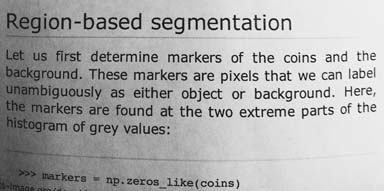
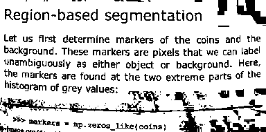
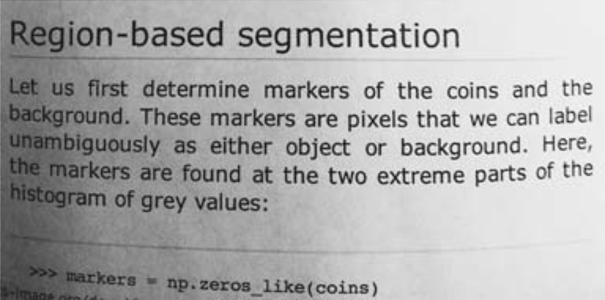

# 数字图像处理 · 第二次作业报告
## 问题一
记灰度值 $i\in{0, 1, \dots, 255}$，$h(i)=\#\{(x,y):f(x,y)=i\}$，也就是灰度值为 $i$ 的像素个数。

记 $N=\sum_{i=0}^{255}h(i), M=\sum_{i=0}^{255}ih(i), \mu = \frac{M}{N}$。BGT算法可表述为：
1. 令 $T=\mu$
2. $$\mu_0 = \frac{\sum_{i=0}^T ih(i)}{\sum_{i=0}^T h(i)}$$

3. $$\mu_1 = \frac{M-\sum_{i=0}^T ih(i)}{N-\sum_{i=0}^T h(i)}$$

4. 令 $T=\frac{\mu_0+\mu_1}{2}$，回到步骤2直到 $T$ 不发生变化。

## 问题二

### 算法设计

采用局部 Otsu 阈值分割。对每个像素 $(x,y)$，在其周围取 $31\times31$ 的窗口，统计灰度直方图 $h_{x,y}(i)$。记窗口内总像素数为 $n$，总灰度和为 $M$，并定义累计像素数和累计灰度和：

$$
B_t=\sum_{i=0}^{t}h_{x,y}(i),\qquad
S_t=\sum_{i=0}^{t}i\,h_{x,y}(i),\qquad
M=\sum_{i=0}^{255}i\,h_{x,y}(i).
$$

由 Otsu 类间方差公式，可以省略不影响最优阈值的常数因子 $n^2$，最大化

$$
J(t)=\frac{(nS_t-MB_t)^2}{B_t(n-B_t)},\qquad 0<B_t<n.
$$

由于这里把灰度 $i\le t$ 划入第一类，代码返回的二值化阈值为 $T(x,y)=\arg\max_t J(t)+1$。随后令灰度不小于 $T(x,y)$ 的像素为白色，其余为黑色。

实现中使用镜像填充处理图像边缘，并用滑动窗口更新局部直方图：窗口移动时，只减去移出的行或列、加上新进入的行或列。使用 NumPy 的累计求和计算 Otsu 所需的统计量。完整代码见 [p2.py](p2.py)。

### 数据与实验结果

测试图像为 [input.png](img/input.png)，是一张 $384\times191$ 的灰度文档图像，存在局部亮度不均。局部窗口大小设为 $31\times31$，结果保存为 [local_otsu_result.png](img/local_otsu_result.png)。

原图：

局部 Otsu 结果：

结果表明，主要文字得到了黑白分离；部分背景纹理也被分为黑色，说明局部 Otsu 仍可能把局部灰度波动误判为前景。

## 问题三

### 算法设计

自行实现二维双线性插值，不调用图像库的插值函数。设放大倍数为 $N$，对输出像素 $(x',y')$ 采用像素中心对齐的逆映射：

$$
x=\frac{x'+0.5}{N}-0.5,\qquad
y=\frac{y'+0.5}{N}-0.5.
$$

令 $x_0=\lfloor x\rfloor,\ y_0=\lfloor y\rfloor$，相对坐标 $u=x-x_0,\ v=y-y_0$。以四个相邻像素的灰度或颜色通道值 $I_{00},I_{10},I_{01},I_{11}$ 计算：

$$
I(x,y)=(1-u)(1-v)I_{00}+u(1-v)I_{10}
+(1-u)vI_{01}+uvI_{11}.
$$

程序逐像素执行坐标映射与加权计算，OpenCV 仅用于图像读写，完整代码见 [p3.py](p3.py)。

### 数据与实验结果

采用同一张 [input.png](img/input.png) 作为输入，放大倍数取 $N=3$。原图分辨率为 $384\times191$，输出分辨率为 $1152\times573$，保存为 [enlarged.png](img/enlarged.png)。

双线性插值通过邻域加权估计新增像素，使放大后的灰度过渡更连续，但不会恢复原图中不存在的细节。
